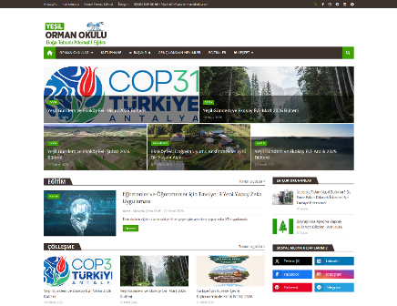
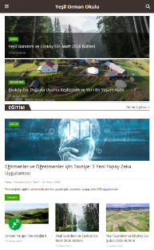

```markdown
# 🌲 Yeşil Orman Okulu Mimarisi
```text
-----------------------------------------------
Name:        Yeşil Orman Okulu
Version:     v3.03
Author:      SuleymanCetin tarafından ❤️ ile tasarlanmıştır.
                      .  .                                            
          \ \   ___   _  _   _     ____   __  __   __  __     __     _   _ 
           \ \ / __| | || | | |    | ___|  \ \/ /  |  \/  |   /  \   | \ | |
           / / \__ \ | || | | |__  | __|    \  /   | |\/| |  / /\ \  |  \| |
          /_/  |___/  \__/  |____| |____|   /_/    |_|  |_| /_/  \_\ |_| \_|
-----------------------------------------------
```

## 📖 Proje Hakkında

**Yeşil Orman Okulu**, XML tabanlı özel bir tema mimarisi üzerine kurgulanmış, doğa dostu vizyonu yansıtan modern ve kullanıcı odaklı bir web arayüzü projesidir. 

Bu depo, temanın tamamını (full `.xml` dosyasını) değil; projenin **Mobil Mimarisini, Kullanıcı Deneyimini (UX) ve Çekirdek UI Bileşenlerini** sergilemek amacıyla oluşturulmuştur. Günümüz web standartlarına uygun olarak *Mobile-First (Mobil Öncelikli)* bir yaklaşımla kodlanmış olup, dar ekranlardaki etkileşimlere, menü performansına ve erişilebilirliğe odaklanılmaktadır.

## ✨ Öne Çıkan Özellikler ve Mimari Detaylar

Bu projede UI/UX standartlarını yükseltmek adına aşağıdaki mimari kararlar uygulanmıştır:

*   **📱 Mobil Öncelikli Yapı:** Eski nesil görünümler terk edilerek, dokunmatik ekranlara ve mobil çözünürlüklere tam uyumlu modern tasarıma geçildi.
*   **📐 Optimize Edilmiş Grid Sistemi:** Tam 1200px genişliğinde, boşluksuz ve simetrik 3 sütunlu (%33.33) kusursuz alt bilgi (footer) ve içerik hiyerarşisi.
*   **🇹🇷 Yerel Standartlar ve Erişilebilirlik:** Tam kapsamlı Türkçe karakter (İ, ş, ğ, ç) font desteği ve Türkiye standartlarına (GG/AA/YYYY) uygun tarih gösterimi.
*   **🎨 Modern Tipografi ve İkonografi:** "Capitalize" başlık düzenleri, güncel sosyal medya standartları (yeni siyah X logosu) ve güncellenmiş ikon setleri.
*   **⚡ Performans Dokunuşları:** Thumbnail (küçük resim) yüklenme optimizasyonları ve ortak kalite standartlarıyla iyileştirilmiş görsel performansı.

## 🛠️ Kullanılan Teknolojiler

*   **HTML5 & CSS3:** Semantik yapı ve modern stil kurguları.
*   **Vanilla JavaScript:** Hafif ve performanslı etkileşimler.
*   **XML Yapısı:** Özel değişkenler ve etiket mantığı.

## 🚀 Canlı Demo

Temanın tam sürümünün canlı halini incelemek için:
👉 **[www.yesilormanokulu.com](https://www.yesilormanokulu.com/)**

---

*Bu proje SuleymanCetin tarafından geliştirilmiş ve sürdürülmektedir.*

| 💻 Masaüstü Görünümü | 📱 Mobil Görünüm |

|  |  |
